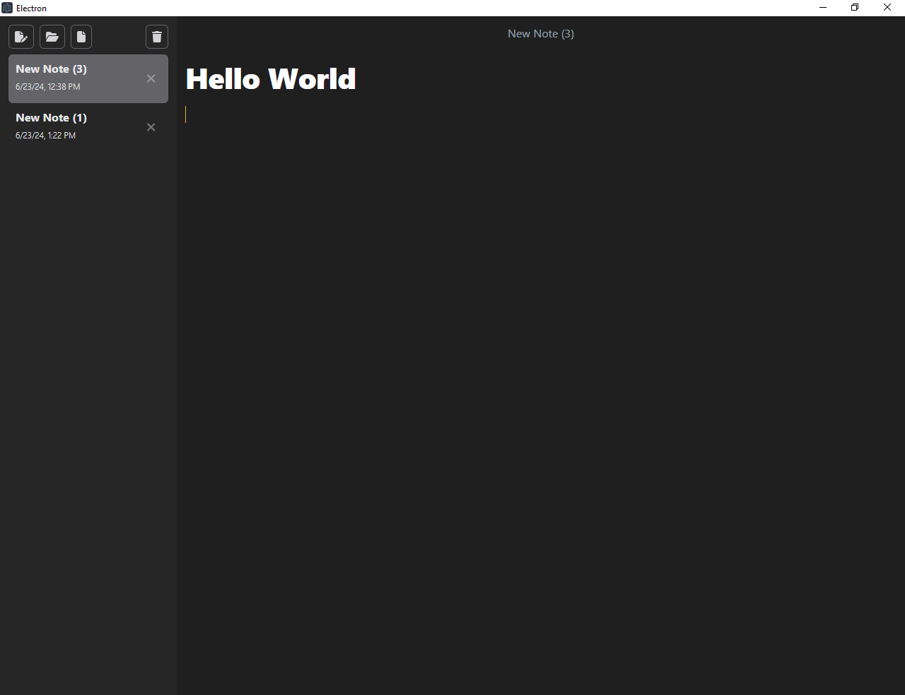

# MarkDown Editor by Electron

Welcome to the Markdown Editor App! This application is designed to provide a simple yet powerful markdown editing experience for Windows users. With a sleek interface and essential features, it allows you to focus on your writing without distractions. The app is built using modern web technologies, ensuring a smooth and responsive user experience.




## Features

- Open Folder and File: Easily open and manage your markdown files and folders. - - Navigate through your file system and load your markdown files directly into the editor.
- Save Last Status: The app remembers your last opened file and cursor position, so you can continue right where you left off.
- Real-time Markdown Preview: View a live preview of your markdown content as you type, making it easy to visualize your formatted text.
- Syntax Highlighting: Enjoy enhanced readability with syntax highlighting for markdown elements.
- User-friendly Interface: The clean and intuitive design, powered by Tailwind CSS, ensures a pleasant editing experience.

## Getting Started

To run the project locally, follow these steps:

1. Clone the repository:

   ```shell
   git clone https://github.com/Emam546/markdowneditor
   ```
2. Install the dependencies:

   ```shell
   npm install
   ```

3. Start the development server:

    ```shell
   npm dev
   ```
